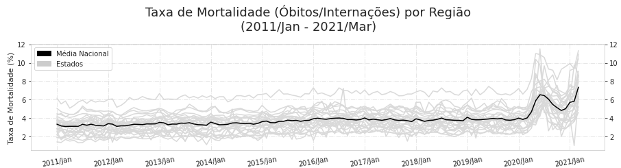

# Internações, Óbitos e Taxa de Mortalidade do SUS entre 2011 e 2021: Impactos da Pandemia

*Versão Preliminar desenvolvida durante o Bootcamp Data Science 2021 da [Alura](https://www.alura.com.br/)*

Este estudo analisa algumas informações do Sistema Único de Saúde do Brasil sobre internações, óbitos e taxa de mortalidade entre janeiro de 2011 e março de 2021, nas 5 regiões e nas 27 unidades federativas, com o objetivo de compreender melhor a evolução destas variáveis e observar como a pandemia tem impactado cada uma delas.

A organização do notebook [disponível aqui](https://github.com/mumaral/internacoes-obitos-sus/blob/main/projeto-modulo-1.ipynb) está feita em duas partes:

Na primeira, estão agrupadas a limpeza dos dados, exposições iniciais das bases de dados e definição de funções que serão posteriormente utilizada. A proposta é concentrar nesta **primeira parte** a complexidade técnica da análise, como grandes blocos de código.

Assim, é possível abstrair estas complexidades da segunda parte, tornando-a mais acessível a leitores que não tenham familiaridade com programação. A **segunda parte** é dedicada às análises e visualizações dos dados.

# Próximos Passos

O projeto foi elaborado com uma visão de longo prazo que envolve sua atualização conforme novos dados estejam disponíveis e também sua incrementação com mais análises. Buscarei manter o código bem explicado, para incentivar contribuições de outras pessoas.

Nesta **versão preliminar** as prioridades foram: estruturar o *notebook*, organizar os dados e padronizar as visualizações para explorações futuras.

Portanto, alguns incrementos futuros necessários e/ou desejáveis são:

- Desenvolver melhor a análise textual
- Aproveitar a riqueza dos dados para desenvolver e testar hipóteses
- Incluir dados sobre capacidade de internações/número de leitos de cada estado ou região
- Incluir na parte I uma curta seção sobre “como ler gráficos de violino (*violinplots*)”
- Organizar melhor o código transformando as variáveis e funções em atributos e métodos de classes
- Explorar a visualização com dados geoespaciais, utilizada até agora apenas de forma indireta para mostrar o padrão de cores por regiões e unidades da federação

Qualquer ajuda é bem vinda. Se você tem interesse em contribuir com o projeto, sinta-se à vontade para enviar sugestões, correções e críticas.
